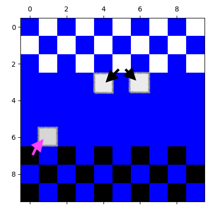

# Partie de dames automatique

Développer un script Python qui lance un partie de dames automatique.

## Règles du jeu de dames

- La grille a une taille de 10x10, qu'on appellera "damier"
- Le jeu se joue à deux joueurs. Le premier joueur a des pions blancs et le deuxième joueur a des pions noirs
- Au début du jeu, les pions du joueur 1 sont agencés sur 4 rangées à partir d'un côté du damier.
- Les pions du joueur sont agencés de façon similaire sur le côté opposé du damier.
- La configurations des pions au début est indiquée dans la figure ci-dessous. Les pions blancs sont représentés par des cases blanches et les pions noirs sont représentés par des cases noires.

- Un pion ne peut peut avance que d'une ligne vers un vers des deux diagonales possibles. Voici un exemple déplacements possible d'une case blanche et d'une case noire.

- Si un pion rencontre un pion adverse, il est obligé de le manger et d'avancer d'une case supplémentaire.

- Le jeu s'arrête dès qu'un joueur n'a plus de pions.

- [Ce site](https://slagzet.com/fr/play-computer) propose de tester le jeu et voir les règles complètes

## Travail demandé

- Développer un jeu du damier où les deux joueurs sont jouées par une IA basique.
- Pour chaque tour, l'action du joueur est exécutée de façon aléatoire parmi la liste de ses possibles.
- Implémenter les règles du jeu au maximum.
