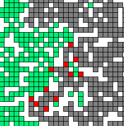

# Séminaire d'algorithmie sur le jeu de la vie

## Prérequis

- Installer un gestionnaire de paquets (permet d'installer facilement des programmes)
    - Windows: [scoop.sh](https://scoop.sh/)
    - MacOS: [homebrew](https://brew.sh/)
- Une fois l'installation terminée, ouvrir un nouveau terminal pour installer python
    - Windows: `scoop install python`
    - MacOS: `brew install python`
- Installer [Visual Studio Code (ou VSCode)](https://code.visualstudio.com/)
    - Installer l'extension [python de VSCode](https://marketplace.visualstudio.com/items?itemName=ms-python.python) 

## Automate cellulaire

- Objet mathématique, étudié aussi en informatique théorique, évoluant par étapes selon des règles très simples et imitant d'une certaine manière les capacités autoreproductrices des êtres vivants.
- Un automate cellulaire se déroule sur une grille.
- Chaque des cases de la grille est appelée **une cellule**.
- Les cellules peuvent prendre plusieurs états.

<figure markdown>
  
  <figcaption>Vert: arbres, rouge: feu, gris: cendre</figcaption>
</figure>

## Jeu de la vie

- Inventé par le mathématicien britannique John Horton Conway en 1970.
- C'est l'application la plus célèbre des automates cellulaires.
- Chacune de ces cellules a deux états possibles : **vivante** ou **morte**.
- L'évolution est déterminée par un ensemble de règles simples mais permettent d’obtenir des motifs très complexes.

<figure markdown>
  
  <figcaption>Exemple d'évolution du jeu de la vie</figcaption>
</figure>

## Sources

- [www.tutorialspoint.com](https://www.tutorialspoint.com/python_data_structure/python_2darray.htm)
- [andre.lovichi.free.fr](http://andre.lovichi.free.fr/teaching/ea/2014-2015/cours/premieres/18/18-TD-Le_jeu_de_la_vie.pdf)
- [www.apprendre-en-ligne.net](https://www.apprendre-en-ligne.net/pj/automates/chapitre12.pdf)
- [www.futura-sciences.com](https://www.futura-sciences.com/tech/definitions/informatique-automate-cellulaire-8909/)
- [fr.wikipedia.org](https://fr.wikipedia.org/wiki/Automate_cellulaire)